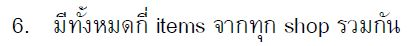
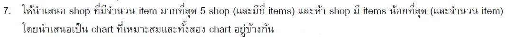
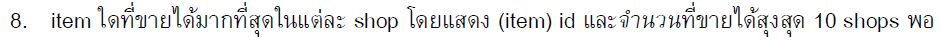
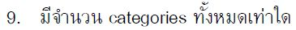
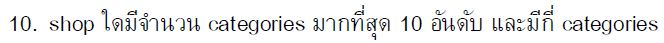

# Product Sales

There are four datasets in total. It informs about sales revenue. From 2013 until 2015, data was collected. (The whole detail is based on a hypothetical event.)


>Questios part












👉 [jupyter notebook](https://github.com/tan-koo/Product-Selling/blob/master/jupyter/sales.ipynb) This is the ```code``` I wrote.