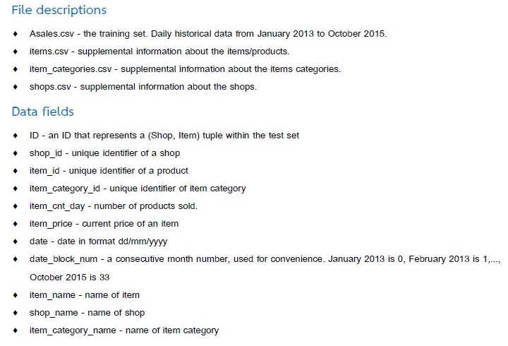
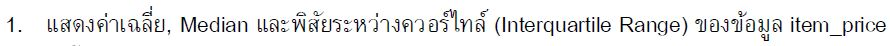
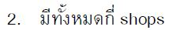
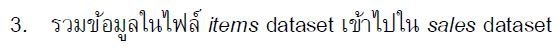
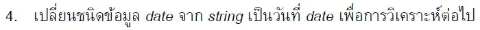
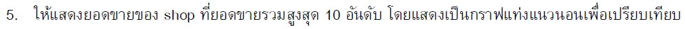

# Product Sales

There are four datasets in total. It informs about sales revenue. From 2013 until 2015, data was collected. The task's objective is readily apparent under condition order. (The whole detail is based on a hypothetical event.)



>Five-question sample from a total of seventeen.











👉 [jupyter notebook](https://github.com/tan-koo/Product-Selling/blob/master/jupyter/sales.ipynb) This is the ```code``` I wrote.
